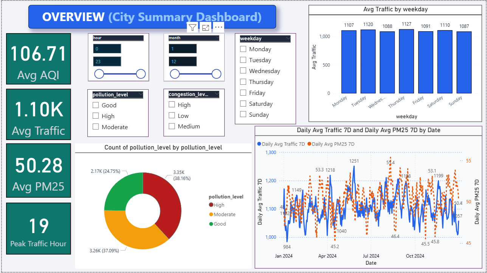
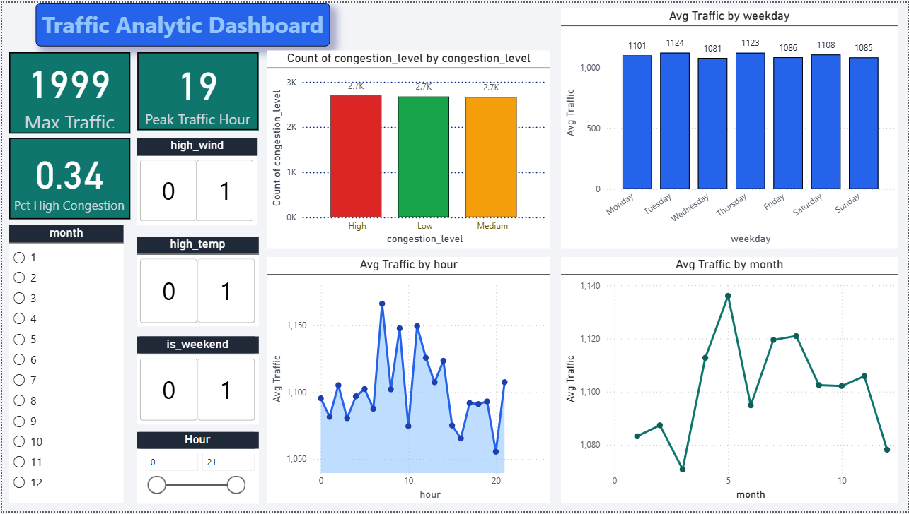
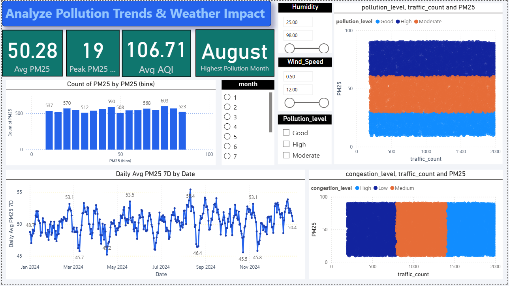

<h1>🚦 Smart City Data Analytics for Traffic & Pollution</h1>

<h2>📌 Project Overview</h2>

Smart City Data Analytics for Traffic & Pollution is a data analytics project that analyzes urban traffic patterns, air pollution levels, and environmental impact using interactive Power BI dashboards.

The project helps understand:

• Traffic congestion trends 
• Air quality (AQI & PM2.5) behavior 
• Peak traffic & pollution hours 
• Relationship between traffic, pollution, and weather 

This supports data-driven decision-making for smart city planning.

<h2>🎯 Objectives</h2>

• Analyze traffic volume and congestion levels 
• Monitor air pollution indicators (AQI & PM2.5) 
• Identify peak traffic and pollution hours 
• Study traffic–pollution correlation 
• Present insights using interactive dashboards 

<h2>🛠️ Tools & Technologies Used</h2>

• Power BI – Dashboards & visual analytics 
• Python (Pandas, NumPy) – Data preprocessing 
• DAX – KPI calculations & time-based measures 
• CSV Dataset – Traffic, pollution & weather data 

<h2>🗂 Dataset Used</h2>
• air_quality_2024.csv 
• traffic_2024.csv 
• weather_2024.csv 
• final_london_master_dataset_2024.csv 

<h2>🧮 DAX Measures Used</h2>

🔹 Basic Averages

Avg AQI = AVERAGE(final_london_master_dataset_2024[AQI])

Avg PM25 = AVERAGE(final_london_master_dataset_2024[PM25])

Avg Traffic = AVERAGE(final_london_master_dataset_2024[traffic_count])

🔹 Daily Averages

Daily Avg PM25 =
CALCULATE(
  AVERAGE(final_london_master_dataset_2024[PM25]),
  ALLEXCEPT(final_london_master_dataset_2024, final_london_master_dataset_2024[Date])
)

Daily Avg Traffic =
CALCULATE(
  AVERAGE(final_london_master_dataset_2024[traffic_count]),
  ALLEXCEPT(final_london_master_dataset_2024, final_london_master_dataset_2024[Date])
)

🔹 7-Day Moving Averages

Daily Avg PM25 7D =
VAR CurrentDate = MAX(final_london_master_dataset_2024[Date])
RETURN
CALCULATE(
    AVERAGE(final_london_master_dataset_2024[PM25]),
    DATESINPERIOD(
        final_london_master_dataset_2024[Date],
        CurrentDate,
        -6,
        DAY
    )
)

Daily Avg Traffic 7D =
VAR CurrentDate = MAX(final_london_master_dataset_2024[Date])
RETURN
CALCULATE(
    AVERAGE(final_london_master_dataset_2024[traffic_count]),
    DATESINPERIOD(
        final_london_master_dataset_2024[Date],
        CurrentDate,
        -6,
        DAY
    )
)

🔹 Peak & Maximum Metrics

Max Traffic = MAX(final_london_master_dataset_2024[traffic_count])

Peak Traffic Hour =
VAR MaxT = MAX(final_london_master_dataset_2024[traffic_count])
RETURN
CALCULATE(
    MAX(final_london_master_dataset_2024[hour]),
    FILTER(ALL(final_london_master_dataset_2024),
           final_london_master_dataset_2024[traffic_count] = MaxT)
)

Peak PM25 Hour =
VAR MaxP = MAX(final_london_master_dataset_2024[PM25])
RETURN
CALCULATE(
    MAX(final_london_master_dataset_2024[hour]),
    FILTER(ALL(final_london_master_dataset_2024),
           final_london_master_dataset_2024[PM25] = MaxP)
)

🔹 Congestion & Pollution Analysis

Pct High Congestion =
DIVIDE(
    CALCULATE(
        COUNTROWS(final_london_master_dataset_2024),
        final_london_master_dataset_2024[Congestion_level] = "High"
    ),
    COUNTROWS(final_london_master_dataset_2024),
    0
)

Pollution Category =
IF(final_london_master_dataset_2024[PM25] > 60, "High",
IF(final_london_master_dataset_2024[PM25] > 30, "Moderate", "Good"))

🔹 Highest Pollution Month

Highest Pollution Month =
VAR MonthAvgTable =
    SUMMARIZE(
        final_london_master_dataset_2024,
        final_london_master_dataset_2024[month],
        "PM25Avg", AVERAGE(final_london_master_dataset_2024[PM25])
    )
VAR MaxMonthRow =
    TOPN(1, MonthAvgTable, [PM25Avg], DESC)
VAR MaxMonthNum =
    MAXX(MaxMonthRow, final_london_master_dataset_2024[month])
RETURN
FORMAT(DATE(2024, MaxMonthNum, 1), "MMMM")

🔹 Traffic–Pollution Covariance

Traffic_PM25_Cov =
VAR MeanT = AVERAGE(final_london_master_dataset_2024[traffic_count])
VAR MeanP = AVERAGE(final_london_master_dataset_2024[PM25])
RETURN
SUMX(
    final_london_master_dataset_2024,
    (final_london_master_dataset_2024[traffic_count] - MeanT) *
    (final_london_master_dataset_2024[PM25] - MeanP)
)

<h2>📊 Dashboard 1: OVERVIEW (City Summary Dashboard)</h2>

High-level overview of city traffic and pollution.

Key KPIs:

• Average AQI 
• Average Traffic 
• Average PM2.5 
• Peak Traffic Hour 

📊 Key Insights

• Traffic and pollution are closely linked – higher traffic levels generally result in higher PM2.5 and AQI values. 
• Weekdays show higher average traffic compared to weekends, indicating office-hour impact. 
• Pollution levels are mostly Moderate to High, showing consistent air quality concerns in the city. 
• The 7-day moving average smooths daily fluctuations, helping identify long-term traffic and pollution trends. 

<h2>📊 Dashboard 2: Traffic Analytics Dashboard</h2>

Focused on traffic flow and congestion patterns.

Key KPIs:

• Maximum Traffic 
• Peak Traffic Hour 
• Percentage of High Congestion 

Key Insights

• Peak traffic occurs in the evening hours, aligning with office closing and commuting times. 
• High congestion accounts for a significant portion of total traffic, especially during weekdays. 
• Traffic volume is higher on working days and drops slightly on weekends. 
• Monthly analysis shows seasonal variation in traffic, indicating travel and activity pattern changes. 

<h2>📊 Dashboard 3: Pollution Trends & Weather Impact Dashboard</h2>

Analyzes pollution behavior and environmental influence.

Key KPIs:

• Average PM2.5 
• Peak PM2.5 Hour 
• Average AQI 
• Highest Pollution Month 

Key Insights

• PM2.5 levels increase as traffic volume increases, confirming traffic as a major pollution contributor. 
• Highest pollution is observed in August, indicating seasonal and environmental impact. 
• Low wind speed and high humidity worsen pollution levels, as pollutants disperse less. 
• Pollution remains elevated during high congestion periods, showing a direct traffic–pollution relationship. 

<h3>📈 Overall Insights Summary</h3>

• Traffic congestion is the primary driver of air pollution — higher traffic volumes consistently lead to increased PM2.5 and AQI levels. 
• Evening peak hours and weekdays experience the highest traffic and pollution, mainly due to work-hour commuting patterns. 
• Seasonal effects are clearly visible, with certain months (like August) showing significantly higher pollution levels. 
• Weather conditions influence pollution severity — low wind speed and high humidity reduce pollutant dispersion and worsen air quality. 
• Using 7-day moving averages reveals stable long-term trends, helping city planners move beyond daily fluctuations. 
• The dashboards together provide a holistic, data-driven view of urban mobility and environmental health, supporting smarter traffic management and pollution control strategies. 

🚀 Future Enhancements

• Real-time API data integration 
• Predictive traffic & pollution forecasting 
• City-to-city comparison dashboards 
• Public pollution alert system 

✅ This project shows how traffic congestion, time of day, and weather conditions directly impact air pollution, helping cities make smarter, data-driven planning decisions.